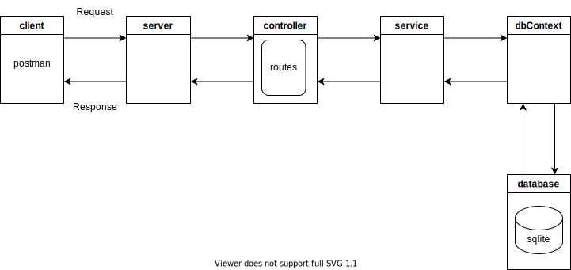

# flask-rest-py-sqlite-api

A simple rest api using flask (python) and sqlite

## Requirements

* flask-restful ([https://github.com/flask-restful/flask-restful](https://))
* sqlite ([https://sqlite.org/index.html](https://))
* sqlite3 ([https://docs.python.org/3/library/sqlite3.html](https://))
* Postman (optional for testing api)
* SQLiteStudio (optional for managing database) ([https://sqlite.org/index.html](https://))

## Diagram



## Components

* **config (config.json, config.py)**

  - configuration file
* **server (api.py)**

  - creates server and listens on a port 3000
* **controller (controller.py)**

  - defines routing and request handlers
* **service (service.py)**

  - handles business logic
* **model**

  - data
* **dbContext (dbContext.py)**

  - handles db connection
* **database (sqlite)**

  - sqlite database

## Run

Run the following command from the root directory:

```
python api.py
```

## Tests

Try the following urls in Postman.

* GetTasks (GET)

  * http://127.0.0.1:3000/tasks
* GetTask (GET)

  * http://127.0.0.1:3000/tasks/1
* AddTask (POST)

  * http://127.0.0.1:3000/tasks
  * body -> raw, json
  * { "id" : "1", "name": "task1", "description": "task1", "priority": "low", "status": "none" }
* UpdateTask (PUT)

  * http://127.0.0.1:3000/task/1
  * body -> raw, json
  * { "id" : "1", "name": "task11", "description": "task11", "priority": "medium", "status": "started" }
* DeleteTask (DELETE)

  * http://127.0.0.1:3000/task/1
  * body -> raw, json
  * { "id" : "1" }
